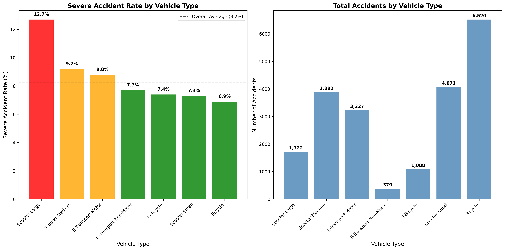

## Project Overview

## How to run this project on your computer?

### Quick Start 

### Prerequisites Details

#### Docker Installation

The project requires Docker and Docker Compose. If you don't have them installed:

* **macOS**: `brew install --cask docker` (or download Docker Desktop)
* Or check: [https://docs.docker.com/engine/install/](https://docs.docker.com/engine/install/)

#### Google Cloud Setup

**Quick Setup:**

1. Create a Google Cloud project named `safe-biking-in-paris` and enable BigQuery, Cloud Storage, and Cloud Resource Manager API
2. Create a service account with BigQuery and Storage permissions
3. Download the service account key as JSON
4. Rename the file to `credentials.json` and place it in the project root.

Please check [this doc](docs/google-cloud-setup.md) for `credentials.json` configuration.

### Command

The following command automatically downloads the accident files, cleans the data, performs machine learning, and generates the visualizations.

```bash
# 1. Clone the repository
git clone https://github.com/fengyu20/safe-biking-in-paris
cd safe-biking-in-paris

# 2. Check prerequisites and get setup guidance
make setup

# 3. Run the complete data pipeline
make up
```
 
## Components Breakdown

> [!NOTE]  
> Note: The following explanation assumes readers have a general understanding of the relevant tools. Only a high-level explanation of tools will be provided; feel free to check [the blog posts](https://fengyu20.github.io/categories/#data) to learn the basics of tools.

### Data Source Explained

The related dataset ([https://www.data.gouv.fr/fr/datasets/bases-de-donnees-annuelles-des-accidents-corporels-de-la-circulation-routiere-annees-de-2005-a-2023/#/resources](https://www.data.gouv.fr/fr/datasets/bases-de-donnees-annuelles-des-accidents-corporels-de-la-circulation-routiere-annees-de-2005-a-2023/#/resources)) contains detailed information on traffic accidents (when, where, and under what conditions crashes occur), plus details on vehicles and people involved. Each year includes around 50,000 accidents, with data available from 2019 to 2023.


The field explanation can be found in this file: [metadata](docs/accidents_metadata_en.md)

### Infrastructure as Code: Terraform Integration

#### Introduction

The Google Cloud resources (bucket, BigQuery dataset) are managed by Terraform. This ensures a consistent, version-controlled infrastructure setup.

#### Workflow

**Initial Setup:**
Initialize Terraform:

```bash
docker-compose run --rm infra init
```

**Workflow for Infrastructure Changes:**
When you need to make changes to your infrastructure:

1. **Edit Configuration:** Modify the Terraform files (e.g., `main.tf`) in the `./infra` directory
2. **Review the Plan:** `terraform plan`
3. **Apply Changes:**: `terraform apply`
4. **Delete Relevant Resources:**: `terraform destroy`

#### Advanced: Adding Existing Infrastructure to Terraform

If you have already created the infrastructure using Google Cloud but want Terraform to manage it later, you need to let Terraform know that these resources exist. One way is to import them as follows:

```bash
terraform import "google_storage_bucket.biking-in-paris-bucket" "biking-in-paris-bucket"
terraform import "google_bigquery_dataset.accidents" "projects/biking-in-paris/datasets/accidents"
```

Then, if you use the command `terraform state list` to check, you can notice the following output:

```bash
zoe@Mac infra % terraform state list
google_bigquery_dataset.accidents
google_storage_bucket.biking-in-paris-bucket
```

### Data Ingestion

#### Introduction

The ingestion module downloads the accident data files from the open data platform (URLs managed by a separate file) and uploads them to the Google Cloud Storage bucket created by Terraform.

#### `ingest_manifest.yaml` Explained

The `ingest_manifest.yaml` file contains URLs for each year's datasets. When new data becomes available, manually update this file with the new URLs from the [official data portal](https://www.data.gouv.fr/fr/datasets/bases-de-donnees-annuelles-des-accidents-corporels-de-la-circulation-routiere-annees-de-2005-a-2023/).

Example manifest structure:

```yaml
years:
  "2023":
    vehicules: https://www.data.gouv.fr/fr/datasets/r/146a42f5-19f0-4b3e-a887-5cd8fbef057b
    usagers:   https://www.data.gouv.fr/fr/datasets/r/68848e2a-28dd-4efc-9d5f-d512f7dbe66f
    lieux:     https://www.data.gouv.fr/fr/datasets/r/8bef19bf-a5e4-46b3-b5f9-a145da4686bc
    caract:    https://www.data.gouv.fr/fr/datasets/r/104dbb32-704f-4e99-a71e-43563cb604f2
```

#### Workflow

To update the data each year when new datasets are released:

1. **Find the new URLs on data.gouv.fr**:

   * Go to the [official data portal](https://www.data.gouv.fr/fr/datasets/bases-de-donnees-annuelles-des-accidents-corporels-de-la-circulation-routiere-annees-de-2005-a-2023/) and find the download links manually.

2. **Update the manifest file**:

   * Edit `ingest_manifest.yaml` and add the new URLs under the appropriate year.

3. **Run the following command**:

   * `docker-compose run --rm ingestion`
   * It will only download the newly uploaded data.

### Data Transformation

#### Why dbt

In the traditional data engineering pipeline (ETL: Extract, Transform, Load), if transformation logic changes later, we often need to redo the extract step. The main idea of using dbt for data transformation is to avoid back-and-forth revisions: it works on data warehouses and transforms raw data into ready-to-use data.


[Source](https://www.getdbt.com/product/what-is-dbt)

#### How dbt is Used in This Project

The transformation reads data from external tables in BigQuery that point to CSV files in Google Cloud Storage:

```
gs://biking-in-paris-bucket/
└── data/
    └── raw/
        ├── 2019/
        │   ├── caract.csv    # Accident characteristics
        │   ├── lieux.csv     # Location details  
        │   ├── usagers.csv   # User/victim details
        │   └── vehicules.csv # Vehicle details
        ├── 2020/
        └── ...
```

The external tables in `models/src.yml` use wildcard patterns to read across all years (dbt packages needed):

* `gs://biking-in-paris-bucket/data/raw/*/caract.csv`
* `gs://biking-in-paris-bucket/data/raw/*/lieux.csv`
* `gs://biking-in-paris-bucket/data/raw/*/usagers.csv`
* `gs://biking-in-paris-bucket/data/raw/*/vehicules.csv`

The following external tables are created based on the CSV files:

* `stg_caract`: Accident characteristics
* `stg_lieux`: Location and road details
* `stg_vehicules`: Vehicle information
* `stg_usagers`: User (person) information

Based on these staging models, a mart model is created: `fct_accidents`.

And based on this base model:

1. Data visualization model `fct_accidents_hr`: translates machine-readable codes into human-readable format. This step helps us prepare for machine learning and gain general insights.
2. Machine learning–based model `fct_accident_causes`: picks features from the source table:

   1. `fct_bike_accidents_idf`: filters bike accidents in Île-de-France—there are only around 7,000 accidents, which might influence accuracy.
   2. `fct_micromobility_accidents_idf`: includes micromobility, which has about 20,000 accidents.

Errors encountered & tips on using dbt can be found in [this doc](docs/raw_data_cleaning_notes.md)

### Machine Learning

#### Introduction

This module focuses on accident severity prediction and risk analysis for bicycle and micromobility accidents in Île-de-France using machine learning techniques. It analyzes patterns in accident data to identify key risk factors and generate actionable safety recommendations.

The analysis uses dbt-transformed BigQuery tables that contain cleaned and enriched accident data:
- `fct_bike_accidents_idf` - 7,811 bicycle accidents in Île-de-France
- `fct_micromobility_accidents_idf` - 20,889  micromobility accidents (bikes, e-bikes, scooters, e-scooters) in Île-de-France


This project uses Random Forest, with a focus on predicting `is_severe_accident` (binary classification), with other features like weather, light conditions etc.

After analysing, we can results as follows:
1. 
1. **Large scooters have 12.7% severe accident rate** vs 6.9% for bicycles (1.8x more dangerous)
   


###  How to use it
