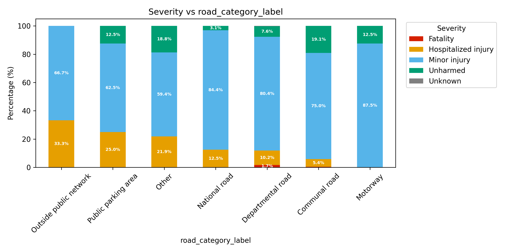

## Project Overview

## How to run this project on your computer?

### Quick Start 

### Prerequisites Details

#### Docker Installation

The project requires Docker and Docker Compose. If you don't have them installed:

* **macOS**: `brew install --cask docker` (or download Docker Desktop)
* Or check: [https://docs.docker.com/engine/install/](https://docs.docker.com/engine/install/)

#### Google Cloud Setup

**Quick Setup:**

1. Create a Google Cloud project named `safe-biking-in-paris` and enable BigQuery, Cloud Storage, and Cloud Resource Manager API
2. Create a service account with BigQuery and Storage permissions
3. Download the service account key as JSON
4. Rename the file to `credentials.json` and place it in the project root.

Please check [this doc](docs/google-cloud-setup.md) for `credentials.json` configuration.

### Command

The following command automatically downloads the accident files, cleans the data, performs machine learning, and generates the visualizations.

```bash
# 0. Install Docker (Docker Compose V2 Included)
brew install --cask docker
open -a Docker
# If you face the malware blocked issue, run the following command:
# sudo xattr -r -d com.apple.quarantine /Applications/Docker.app

# 1. Clone the repository
git clone https://github.com/fengyu20/safe-biking-in-paris
cd safe-biking-in-paris

# 2. Download the credential and rename to credentials.json in the root folder 

# 3. Check prerequisites and get setup guidance
make setup

# 4. Run the complete data pipeline
make build 
make up
```
 
## Components Breakdown

> [!NOTE]  
> Note: The following explanation assumes readers have a general understanding of the relevant tools. Only a high-level explanation of tools will be provided; feel free to check [the blog posts](https://fengyu20.github.io/categories/#data) to learn the basics of tools.

### Data Source Explained

The related dataset ([https://www.data.gouv.fr/fr/datasets/bases-de-donnees-annuelles-des-accidents-corporels-de-la-circulation-routiere-annees-de-2005-a-2023/#/resources](https://www.data.gouv.fr/fr/datasets/bases-de-donnees-annuelles-des-accidents-corporels-de-la-circulation-routiere-annees-de-2005-a-2023/#/resources)) contains detailed information on traffic accidents (when, where, and under what conditions crashes occur), plus details on vehicles and people involved. Each year includes around 50,000 accidents, with data available from 2019 to 2023.


The field explanation can be found in this file: [metadata](docs/accidents_metadata_en.md)

### Infrastructure as Code: Terraform Integration

#### Introduction

The Google Cloud resources (bucket, BigQuery dataset) are managed by Terraform. This ensures a consistent, version-controlled infrastructure setup.

#### Workflow

**Initial Setup:**
Initialize Terraform:

```bash
docker compose run --rm infra init
```

**Workflow for Infrastructure Changes:**
> Note: As we install the Terraform inside the docker container, so we need to activate the relevant docker by adding `docker compose run --rm infra`. If you interact with Terrafrom direcly, simply call it `terraform plan`.

When you need to make changes to your infrastructure:

1. **Edit Configuration:** Modify the Terraform files (e.g., `main.tf`) in the `./infra` directory
2. **Review the Plan:** `docker compose run --rm infra terraform plan`
3. **Apply Changes:**: `docker compose run --rm infra terraform apply`
4. **Delete Relevant Resources:**: `docker compose run --rm infra terraform destroy`

#### Advanced: Adding Existing Infrastructure to Terraform

If you have already created the infrastructure using Google Cloud but want Terraform to manage it later, you need to let Terraform know that these resources exist. One way is to import them as follows:

```bash
docker compose run --rm infra terraform import "google_storage_bucket.biking-in-paris-bucket" "biking-in-paris-bucket"
docker compose run --rm infra terraform import "google_bigquery_dataset.accidents" "projects/biking-in-paris/datasets/accidents"
```

Then, if you use the command `docker compose run --rm infra terraform state list` to check, you can notice the following output:

```bash
zoe@Mac infra % docker compose run --rm infra terraform state list
google_bigquery_dataset.accidents
google_storage_bucket.biking-in-paris-bucket
```

### Data Ingestion

#### Introduction

The ingestion module downloads the accident data files from the open data platform (URLs managed by a separate file) and uploads them to the Google Cloud Storage bucket created by Terraform.

#### `ingest_manifest.yaml` Explained

The `ingest_manifest.yaml` file contains URLs for each year's datasets. When new data becomes available, manually update this file with the new URLs from the [official data portal](https://www.data.gouv.fr/fr/datasets/bases-de-donnees-annuelles-des-accidents-corporels-de-la-circulation-routiere-annees-de-2005-a-2023/).

Example manifest structure:

```yaml
years:
  "2023":
    vehicules: https://www.data.gouv.fr/fr/datasets/r/146a42f5-19f0-4b3e-a887-5cd8fbef057b
    usagers:   https://www.data.gouv.fr/fr/datasets/r/68848e2a-28dd-4efc-9d5f-d512f7dbe66f
    lieux:     https://www.data.gouv.fr/fr/datasets/r/8bef19bf-a5e4-46b3-b5f9-a145da4686bc
    caract:    https://www.data.gouv.fr/fr/datasets/r/104dbb32-704f-4e99-a71e-43563cb604f2
```

#### Workflow

To update the data each year when new datasets are released:

1. **Find the new URLs on data.gouv.fr**:

   * Go to the [official data portal](https://www.data.gouv.fr/fr/datasets/bases-de-donnees-annuelles-des-accidents-corporels-de-la-circulation-routiere-annees-de-2005-a-2023/) and find the download links manually.

2. **Update the manifest file**:

   * Edit `ingest_manifest.yaml` and add the new URLs under the appropriate year.

3. **Run the following command**:

   * `docker compose run --rm ingestion`
   * It will only download the newly uploaded data.

### Data Transformation

#### Why dbt

In the traditional data engineering pipeline (ETL: Extract, Transform, Load), if transformation logic changes later, we often need to redo the extract step. The main idea of using dbt for data transformation is to avoid back-and-forth revisions: it works on data warehouses and transforms raw data into ready-to-use data.


[Source](https://www.getdbt.com/product/what-is-dbt)

#### How dbt is Used in This Project

The transformation reads data from external tables in BigQuery that point to CSV files in Google Cloud Storage:

```
gs://biking-in-paris-bucket/
└── data/
    └── raw/
        ├── 2019/
        │   ├── caract.csv    # Accident characteristics
        │   ├── lieux.csv     # Location details  
        │   ├── usagers.csv   # User/victim details
        │   └── vehicules.csv # Vehicle details
        ├── 2020/
        └── ...
```

The external tables in `models/src.yml` use wildcard patterns to read across all years (dbt packages needed):

* `gs://biking-in-paris-bucket/data/raw/*/caract.csv`
* `gs://biking-in-paris-bucket/data/raw/*/lieux.csv`
* `gs://biking-in-paris-bucket/data/raw/*/usagers.csv`
* `gs://biking-in-paris-bucket/data/raw/*/vehicules.csv`

Data flow layers are created as follows (following the [STAR schema](https://www.databricks.com/glossary/star-schema)):

1. **Raw Sources** (`src.yml`):
   - `raw_caract_all` → Accident characteristics (when, where, weather)
   - `raw_lieux_all` → Road/infrastructure details  
   - `raw_usagers_all` → People involved (demographics, injuries)
   - `raw_vehicules_all` → Vehicles and their actions

2. **Staging Models** (`staging/`):
   - `stg_caract` → Cleans dates, times, coordinates
   - `stg_lieux` → Standardizes road categories and conditions
   - `stg_usagers` → Normalizes user roles and severity codes
   - `stg_vehicules` → Harmonizes vehicle categories across years

3. **Core Fact Table** (`marts/fct_accidents.sql`):
   - **Main analytical table** - one row per user per accident
   - **Complex joins** linking accidents → locations → vehicles → users
   - **Handles data quality** issues like vehicle number format changes between years
   - **Enriched dimensions** with calculated fields like age, time buckets

4. **Analytics Layer**:
   - `fct_accidents_hr` → **Human-readable labels** for all coded fields
   - `fct_accidents_ml` → **ML-ready** with feature encoding and missing value handling  
   - `fct_bike_accidents_idf` → **Specialized subset** for bike safety analysis in IDF region


Errors encountered & tips on using dbt can be found in [this doc](docs/raw_data_cleaning_notes.md)

### EDA: Exploratory Data Analysis

### Introduction

Before starting the machine learning phase, let’s first take a look at the dataset.

### How to use it

After launching the container (e.g., `make up` or `docker compose up --build eda`), you can access the `eda.ipynb` notebook at:

```
http://localhost:8888
```


The plots are saved in the `eda/plots` folder. The bars in each plot are ordered by descending severity rate (fatalities + hospitalized injuries).

For example, the following plot compares the severity rate across different road categories:



### Machine Learning

#### Introduction

This module focuses on accident severity prediction and risk analysis for bike accidents in Île-de-France using machine learning techniques. It analyzes patterns in accident data to identify key risk factors and generate actionable safety recommendations.

The analysis use the dbt-transformed BigQuery table [`fct_bike_accidents_idf`](transformation/models/marts/fct_bike_accidents_idf.sql) that contain cleaned accident data.


###  How to use it
